# PPS-Unidad0Actividad4-JcMartin

Vamos a realizar una nueva actividad con git. En esta ocasión crearemos un pequeño proyecto de una página web que podremos visualizar creando un pequeño servidor con php.
Como en la actividad anterior el producto a realizar será el repositorio en github.

## Seguimos configurando Git

Hasta ahora hemos configurado el email y el user con git config. Vamos a configurar algunas cosas más.

1. Configuraremos el editor de comandos. Yo por simplicidad utilizaría nano ``git config — global core.editor nano``

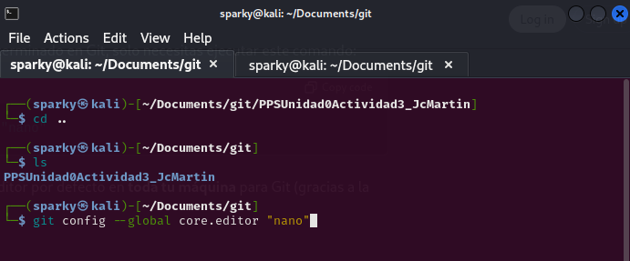

2. Vamos también a configurar para que cuando utilicemos  `git dif` o ``git log`se nos muestre todo el mensaje sin entrar en editor. Para ello `git config — global core.pager ' ' ``.

3. Comprobaremos qué valor tienen las variables de configuración de git. Puedemos utilizar la ayuda ``git config --help``.

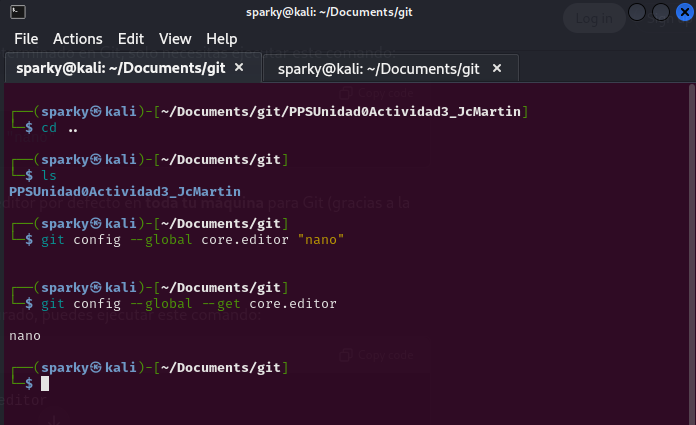

4. Para ajustar los valores de las  variables de Git:

~~~
color.status=auto
color.branch=auto
color.interactive=auto
color.diff=auto
~~~ 

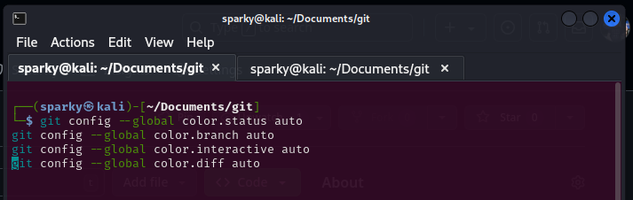

## Creación de Proyecto y repositorio

Para ello crearemos una nueva carpeta en nuestro directorio de git de PPS, con el nombre de esta actividad ___PPS-Unidad0Actividad4-TuNombre___

Creamos un nuevo repositorio público con nombre __PPS-Unidad0Actividad4-TuNombre__

Y siguiendo las indicaciones de github crearemos un nuevo repositorio en linea de comandos, esto es:

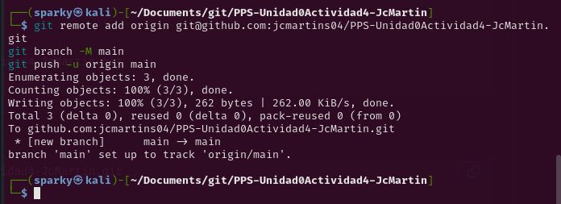

Viene a ser como esto, pero cambiando el nombre de usuario y de repositorio:

~~~
echo "# PPS-Unidad0Actividad4-JcMartin" >> README.md
git init
git add README.md
git commit -m "first commit"
git branch -M main
git remote add origin git@github.com:jcmartins04/PPS-Unidad0Actividad4-JcMartin.git
git push -u origin main
~~~

---
## Iniciando Proyecto 

1. Haremosa un listado en forma de arbol (tree -a) de todos los archivos del directorio.

2. Creamos un archivo con nombre README (si no existe todavía) y lo añadimos al proyecto.

3. Comprueba el estado de git (`git status -s` o `git status --short`. 

4. Escribimos en él una descripción de la actividad y comprobamos su estado.

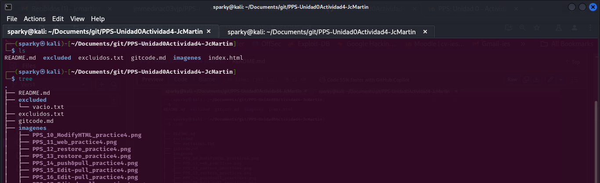

## Ignorando archivos

1. Creamos una carpeta con nombre excluded. En ella vamos a colocar la documentación que no queremos que sea rastreada y subida al repositorio.

2. Para comprobar que funciona creo un archivo vacío allí y también creo un archivo con nombre excluido.txt en el directorio principal del repositorio.
3. Creamos un archivo con nombre .gitignore en el cual vamos a poner los archivos y directorios que no queremos que se rastreen.
4. Indico en el .gitignore, que, los archivos con extensión .txt y el directorio excluded no deben de ser rastreados ni sincronizados..

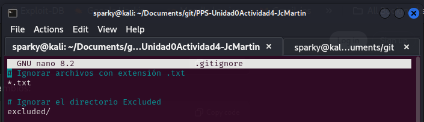

5. Comprobamos el estado del proyecto y compruebamos que no nos indica nada del seguimiento de dichos archivos.

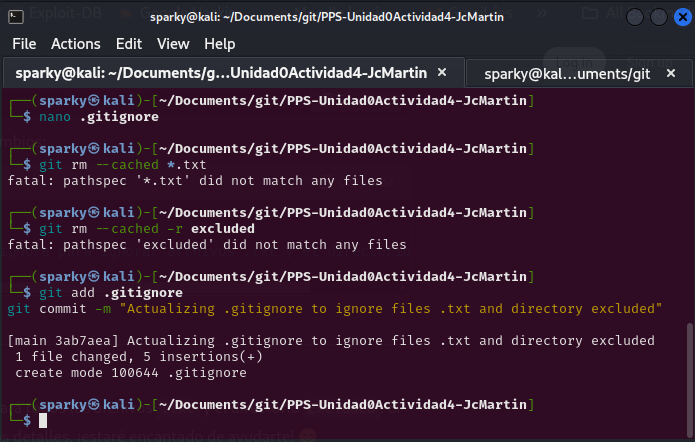

## Trabajo con Git

1. Creo un archivo con nombre index.html. 
2. Introduzco el código html para que nos muestre un mensaje de Hola mundo en una página web sencilla. Algo sencillo como esto:
~~~
   <H1>Hola $USER¡¡¡ ¿Qué tal te encuentras?</H1>
~~~   
3. Visualizo el estado del proyecto ( puede hacerse con  un git status corto ``git status --s` o `git status --short``). 
4. Vemos que indica que tenemos varias operaciones por hacer: git add, git commit...

5. Añadimos el archivo index.html al proyecto (git add).

6. Hacemos un commit (Se puedes hacer ``commit -am "commentario del commit"` de esta manera se añaden las modificaciones de archivos y se hace el commit con el mensaje indicado sin abrir el archivo y tener que escribir nosotros).
7. Comprobamos el estado del proyecto. Puedemos ver como ya esta todo en orden.
8. Volvemos a subir los cambios al repositorio de github (git push)

## Creación de nuestro servidor web y visualización de nuestro proyecto

1. En un nueva pestaña de terminal y en el mismo directorio, ejecuta php -S 0:8080 para lanzar un servidor con la página html que has creado.
2. Visualiza la página creada Puedes acceder a ella en tu navegador en el puerto 8080 de tu equipo: 

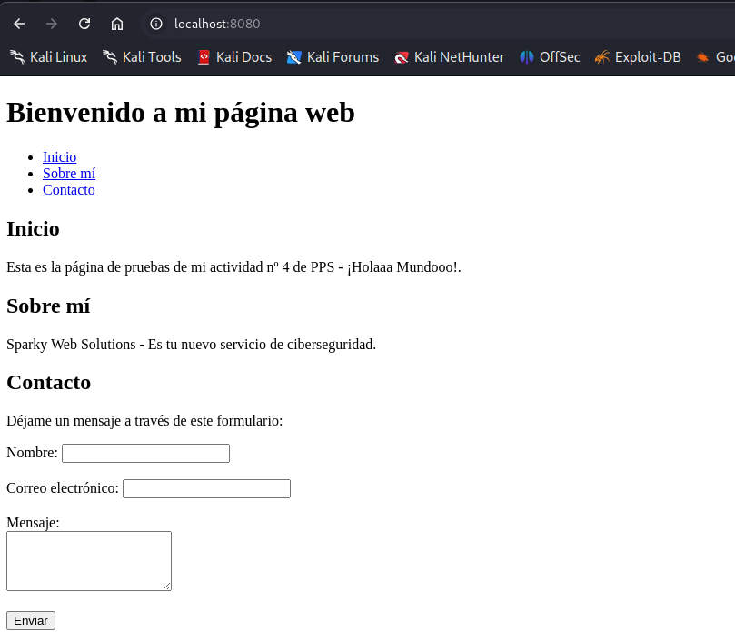

## Seguimos Trabajando con Git

1. Hago  una copia del archivo local index.html con el nombre index.html.save. Modifico el fichero index.html para que cambie el texto mostrado en la página web.
2. Verifica estado del proyecto.

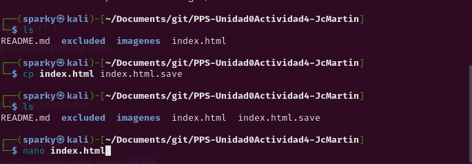

3. Compruebo las diferencias de los archivos que no han sido añadidos (``git diff``)

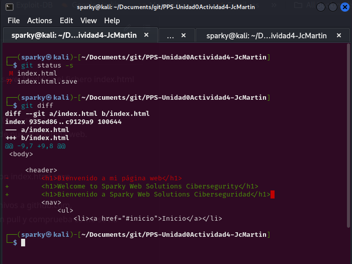

4. Refresco navegador para comprobar que ha cambiado el contenido de nuestra página web.

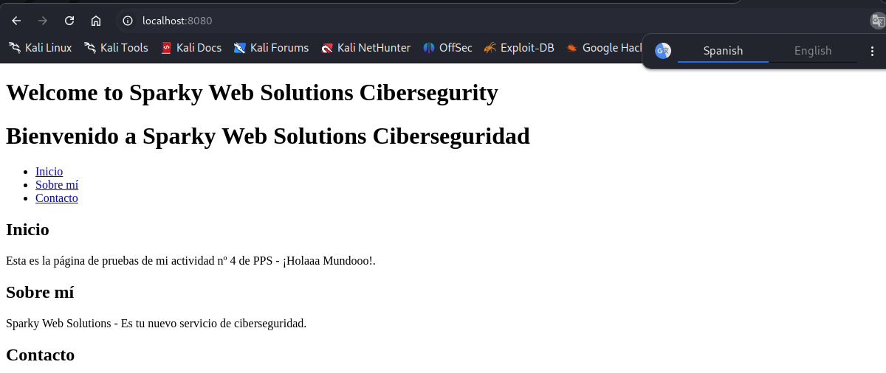

5. Vuelvo a la versión anterior del archivo index.html (git restore).

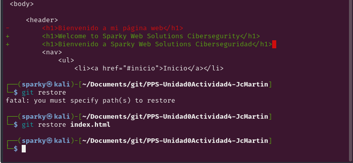

6. Vuelvo a refrescar navegador para ver como vuelve a versión inicial.

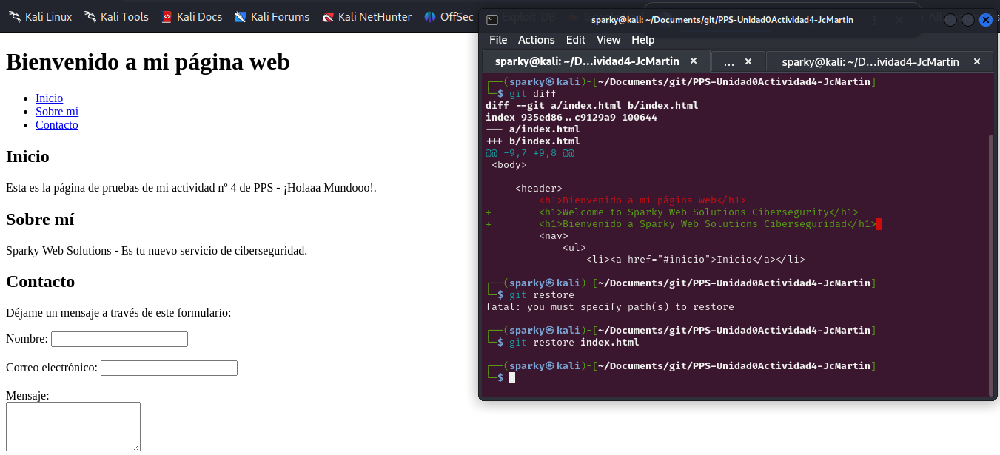

7. Utilizo el comando ``git mv``para sobreescribir el archivo index.html con index.html.save
8. Miro el estado del proyecto y confirmo todos los cambios.
9. Hago pull y push, y tras el push, compruebo cómo han subido los archivos a github.com.

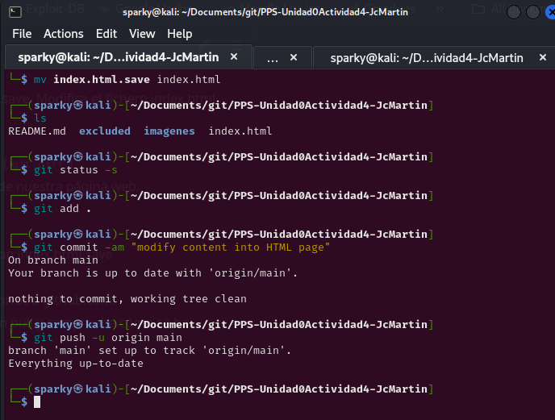

1. Modifico el archivo index.php desde la página de github.com y hago un pull comprobando cómo se ha modificado la página web en nuestro navegador.

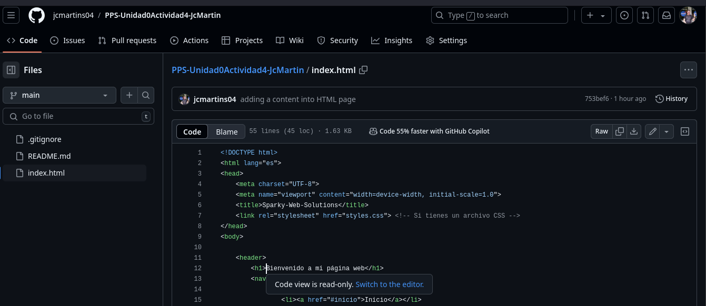

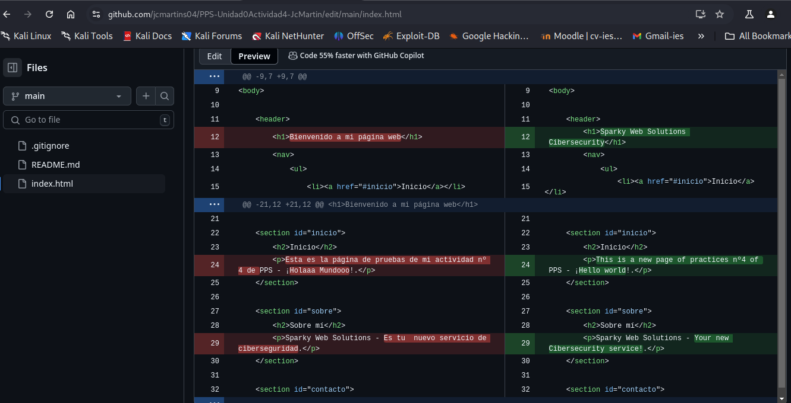

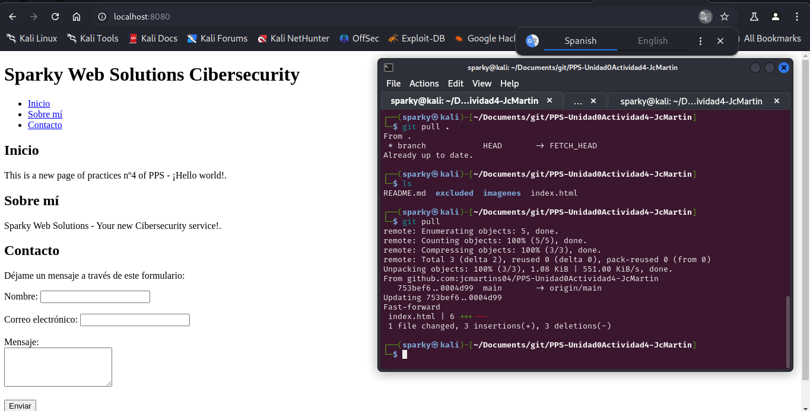

## Git log
1. Tras consultar la página de (Git Book sobre los comandos git log)[https://git-scm.com/book/es/v2/Fundamentos-de-Git-Ver-el-Historial-de-Confirmaciones]
2. Compruebo y muestro los logs 
`git log`

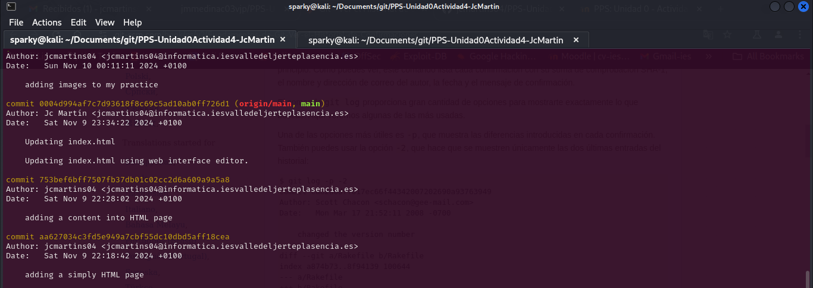

3. Muestro los logs de los últimos 3 commits
`git log -p -3`

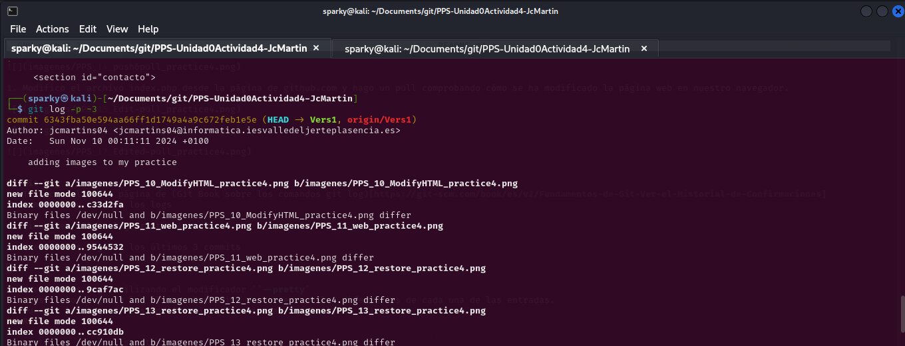

4. Muestro los logs utilizando el modificador ``--pretty`

`git log --pretty=format:"%h - %an, %ar : %s"`

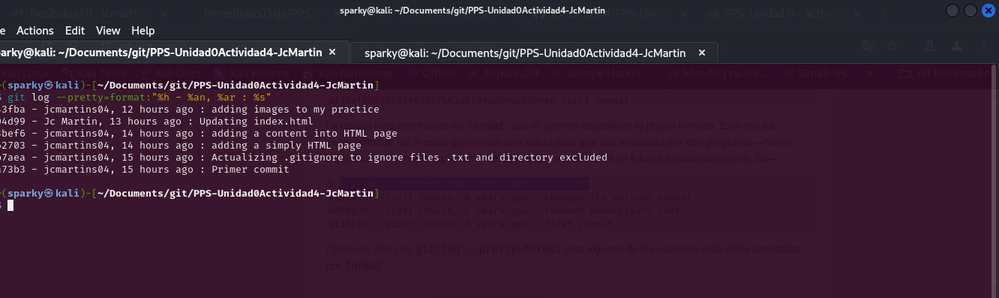

5. Muestro los logs de los últimos 2 commits donde se vean las diferencias de cada una de las entradas.
`git log -p -2`

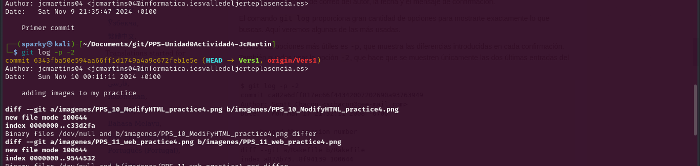

6. Muestro los logs de las modificaciones realizadas en el último día
`git log --since=2.days`

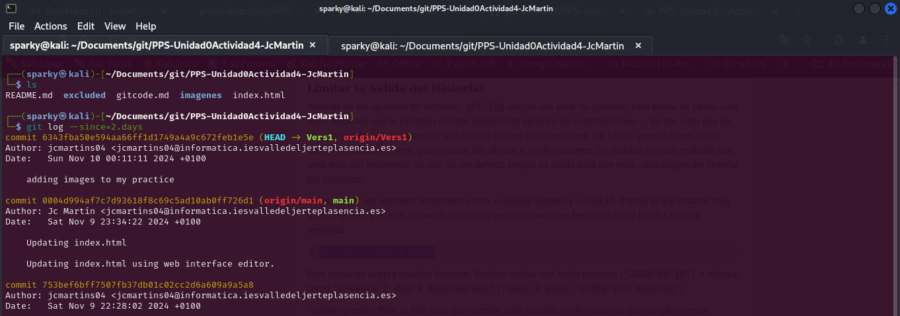

## Ramas

1. Listo las ramas existentes.

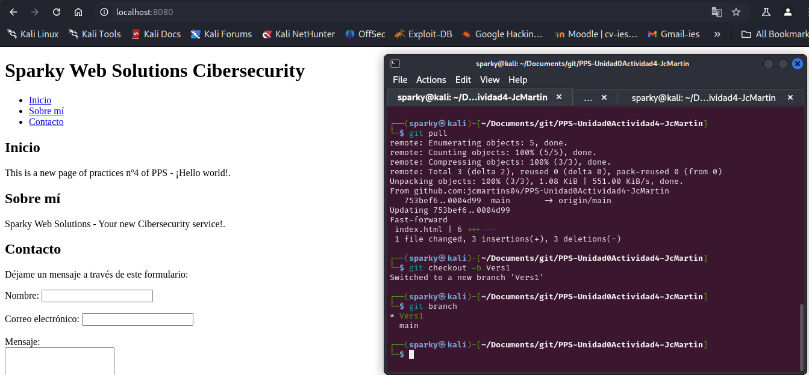

2. Crea una nueva rama con nombre Vers1 a partir de la rama actual.

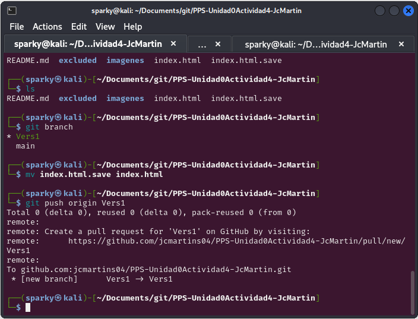

3. Haz una modificación del index.html y guardas modificaciones.

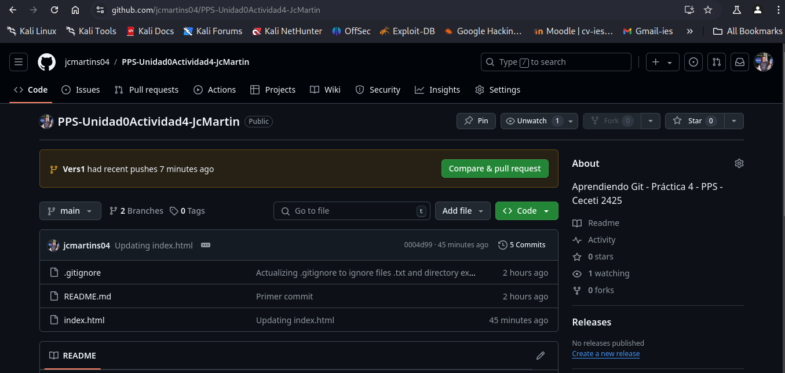

4. Subo los cambios al respositorio remoto a la rama Vers1 `git push origin Vers1` (En este caso podemos ver cómo el index.html de la rama `m̀ain` y `Vers1` son diferentes.

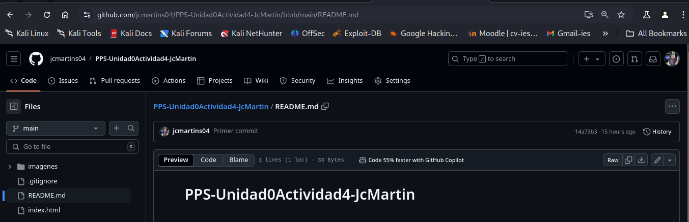

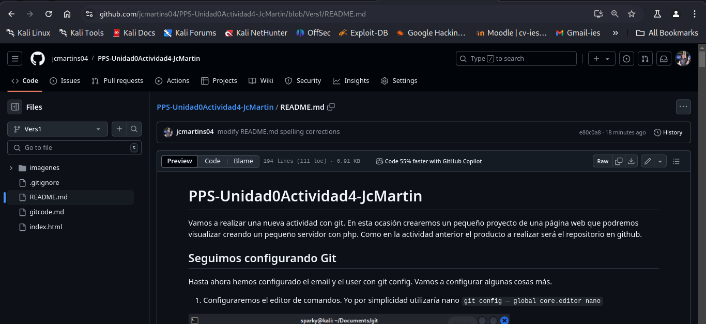

## Fin de la práctica
